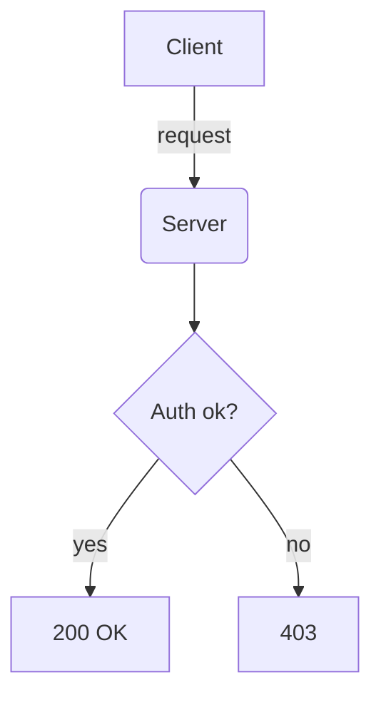

# Blog

A static, client-rendered blog that matches the terminal theme of the main site.
Posts are Markdown files; nothing needs to be compiled or built.

## Structure

```
blog/
├── index.html      # post listing (reads posts.json) with search + tag filter
├── post.html       # single-post renderer (?slug=<slug>)
├── theme.css       # shared Nord/terminal styling
├── posts.json      # manifest of all posts (used by the listing page)
├── posts/          # one <slug>.md per post (Markdown + YAML frontmatter)
├── images/<slug>/  # images for each post
└── scrape.py       # re-runnable importer from lekssays.wordpress.com
```

## Adding a new post

1. Create `posts/my-new-post.md` with frontmatter:

   ```markdown
   ---
   title: "My New Post"
   date: "2026-06-13T10:00:00+00:00"
   modified: "2026-06-13T10:00:00+00:00"
   slug: "my-new-post"
   author: "Ahmed Lekssays"
   featured_image: "../images/my-new-post/cover.jpg"
   categories: ["Computer Science"]
   tags: ["Security", "Notes"]
   original_url: ""
   excerpt: "A one-line summary shown on the listing page."
   ---

   Your Markdown content here.
   ```

2. Put any images under `images/my-new-post/` and reference them with a
   relative path: ``.

3. Add an entry to `posts.json` (newest first) mirroring the frontmatter
   fields (`title`, `date`, `slug`, `excerpt`, `categories`, `tags`,
   `featured_image`, `original_url`, `like_count`).

That's it — the listing and post pages pick it up automatically.

## Markdown features

Standard GitHub-flavored Markdown is supported (headings, tables, lists,
links, blockquotes, images), plus:

### Code with syntax highlighting

````markdown
```python
def hello():
    print("world")
```
````

### Interactive Mermaid diagrams

Use a fenced block with the `mermaid` language. It renders as a live diagram:

````markdown

````

Sequence, flowchart, class, state, gantt, ER, and other Mermaid diagram
types all work — see https://mermaid.js.org for syntax.

## Re-importing from WordPress

`scrape.py` pulls every post from the WordPress.com public API, converts the
HTML to Markdown, downloads the author's own images locally, and regenerates
`posts/` + `posts.json`. Re-run it any time:

```bash
cd blog && python3 scrape.py
```

It needs `requests`, `markdownify`, and `beautifulsoup4`.

## Notes

- Rendering is fully client-side (marked + DOMPurify + highlight.js + mermaid
  from CDNs). Works on GitHub Pages with no build step.
- A few very old posts reference images that were hotlinked from third-party
  sites that no longer exist; those keep their original remote URLs and may
  404. All of the author's own (WordPress-hosted) images are local.
