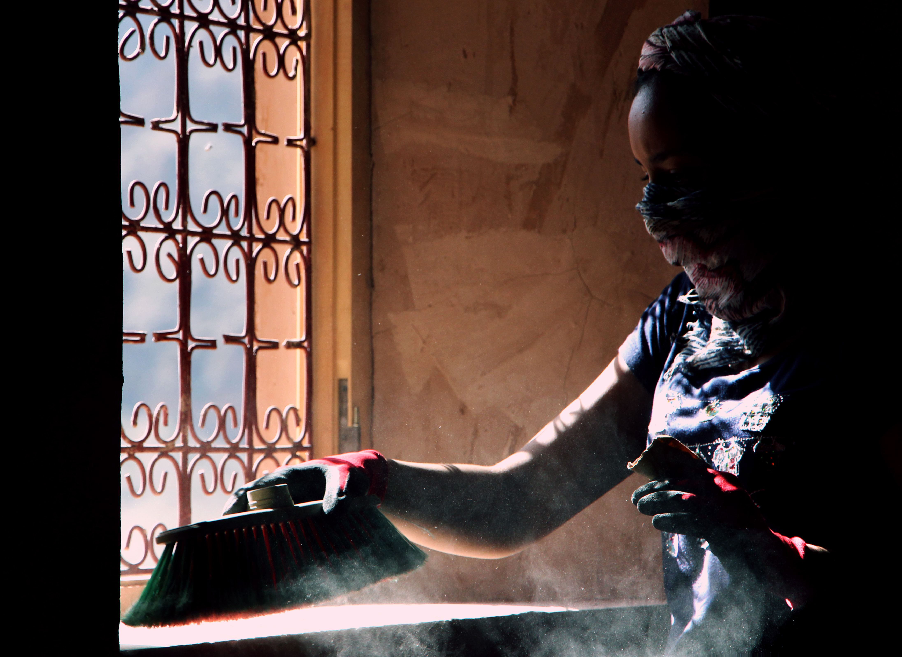
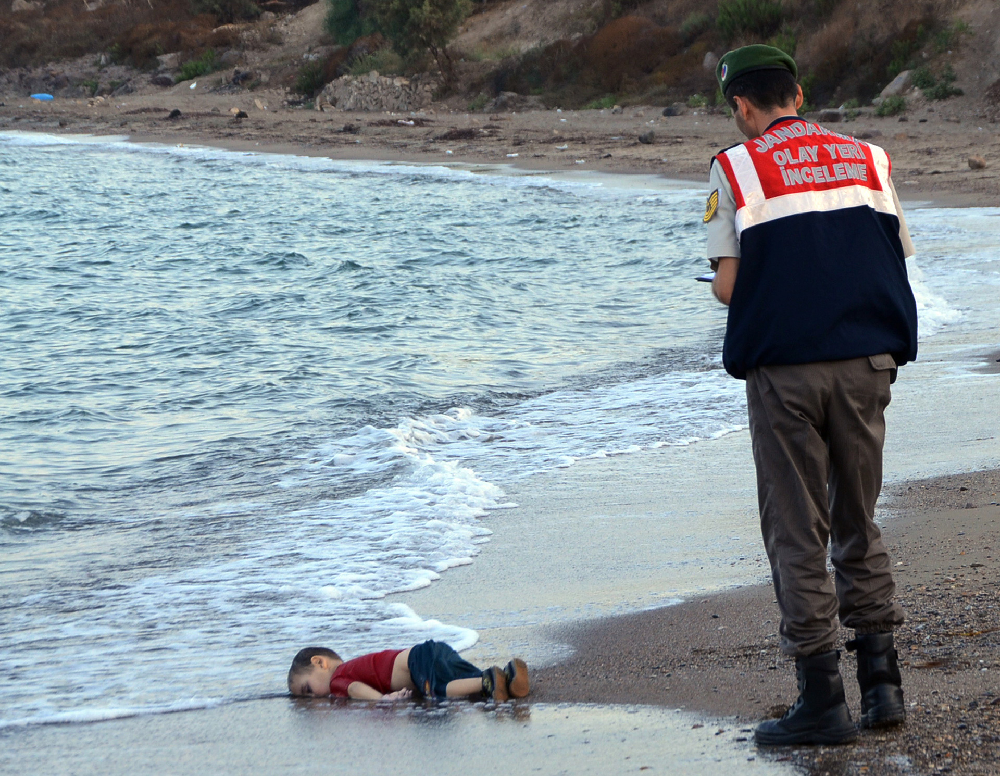

## Overview

"On Photography: In Plato's Cave" is one of the solid chapters that explain how photography works and how we see things through it. It remains a reference in photography because it explains concepts still used today, more than 40 years after the book was published, such as how we view photographs in a modern, technologically developed era.

Sontag begins by throwing light on photographs as entities that can make a person feel he or she owns the world in a single sheet of paper, simply by collecting many of them. Collecting photographs is like collecting the world, since they represent the unique experiences of different people around the globe. They serve as proof and testimony with an incredible power to convince. However, Sontag notes that photographs can also be seen from another perspective: interpretation. She further discusses the role of the camera in helping us realize and relive our experiences. Photographs are also a way to live some experiences without being a part of them, which leads us to construct a nostalgia that combines what we lived and what others lived.

## My Reflections

I strongly liked the chapter because, although it was written many years ago, it still explains and even predicts some aspects of photography today. It also showed how people behave toward photographs and what effects photographs have on them.

### Photographs as Collecting the World

First, I agree with describing photographs as a way of collecting the world. However, we can go beyond that and say that photographs collect the relevant parts of the world that interest the photographer. The uninteresting parts of the world are usually neglected. For instance, trash cans are rarely captured because they do not seem interesting to anyone. Psychologically speaking, human behavior tends toward comfort in seeing good-looking things, so the photographer, as a human being, is always looking for interesting things to capture. In addition, he or she tries to present them from different angles and frames, ones not usually seen, to render them in a more interesting way.

Agouti’s Dust by Mehdi Laziri – Copyright Mehdi Laziri – Unauthorized use is prohibited

Capturing interesting moments has served both personal satisfaction and history. Nowadays, capturing the moment has evolved with social networks, driven by smartphones, which are the most widely used cameras. So, instead of taking a picture for personal satisfaction alone, another variable has been added to what Sontag discussed: sharing. It is no longer just about collecting personal experiences; it has become about sharing those experiences with the world as well.

### Photographs and Interpretation

Second, I agree that photographs can be interpreted in different ways. We can add to that statement that photographs can also serve a certain ideology or religion. They can be used to push people to take action against existing political agendas. Photographs are more powerful than words. From my experience, I have read many political articles about the war in Syria, but honestly they only pushed me to construct a sense of solidarity. However, when I saw the picture of the Syrian child who died when he and his father fled their country looking for peace, I truly realized the damage the war has been causing in Syria. It really pushed me to think and do something to help those who are dying because of political agendas among the major political powers in the world. On the other hand, such photographs by independent photographers show what the mass media hide from the world. They can be seen as an alternative media solution that fills the gap the mass media created.

Alan Kurdi by NILÜFER DEMIR

### Photography, Filters, and Reality

Third, I see Sontag's discussion of photography as a way to make us feel the world is more available to us as an insight into the filters that most social network applications use today. When we take a picture of ourselves, it does not necessarily reflect reality; it represents how we want reality to appear. This differs from manipulating pictures because it is manipulating reality. Applying filters, on the other hand, reflects how reality lives in the photographer's head.

## References

- Demir, N. (2015). ALAN KURDI [“As a father, I felt deeply moved by the sight of that young boy on a beach in Turkey.” -David Cameron, former British Prime Minister]. Retrieved February 12, 2017, from <http://100photos.time.com/photos/nilufer-demir-alan-kurdi>
- Laziri, M. (2016, March 20). Agouti’s Dust [Awesome Volunteer Ouissal cleaning a window while sun is beautifully saying hello.]. Retrieved February 12, 2017, from <http://yourshot.nationalgeographic.com/photos/7961510/>
