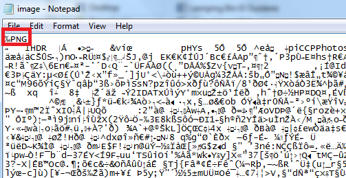
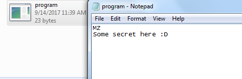

## Introduction

Protecting the sensitive data of a government, and data protection in general, has become a major challenge for security architects around the world. Last year, the Moroccan government faced numerous attacks from different sources. The most notorious was the "Leaks" by "Chris Coleman," who shared sensitive documents on social media.

To help prevent such attacks, this paper explains how governments can use anti-forensics techniques to protect their own sensitive data. It focuses on the techniques that complicate the work of an investigator and on the methodologies for implementing them in order to secure government data. In addition, it suggests possible solutions, such as creating a private cloud platform in each ministry, served over HTTPS and backed by powerful routers capable of withstanding different attacks, in order to protect e-governments by improving how files are shared.

## Data Saturation

Data saturation is a fairly traditional method, as it mainly involves collecting devices and keeping many copies of your data. This step complicates the work of the investigator.

## File Signature Masking

File signature masking is one of the basic steps in anti-forensics. It aims to hide the file signature that determines a file's extension. For instance, if we have a picture (e.g., a .PNG) and a document (e.g., a .PDF) and we want to protect them, we can simply use this method.

The file signature is always the first 4 bytes of any file, and each file type has its own signature. For instance:

- JPG files: ÿØÿà
- ZIP files: PK
- EXE files: MZ
- PNG files: ‰PNG
- PDF files: PDF

As you can see, the figure below is a simple .PNG picture (`image.png`). Unfortunately, you cannot see the signature, so I advise reopening it with Notepad. If you do that, you will see the window below:

*Figure 1: image.png opened with Notepad*

If you change this signature to another file's signature (as mentioned above), the investigator will need a lot of time to recognize the correct file type.

You can also create an .EXE file and match its signature using Notepad. The next figure is another example showing that you can easily hide your data in a fake file type.

*Figure 2: program.exe file written using Notepad.*

## Restricted Filenames

Another anti-forensics method is to rename your folders or files with one of the restricted names. For example, *CON, PRN, AUX, NUL, COM1, COM2, COM3, COM4, COM5, COM6, COM7, COM8, COM9, LPT1, LPT2, LPT3, LPT4, LPT5, LPT6, LPT7, LPT8, and LPT9* are all restricted names in Windows.

These names are restricted because they have a meaning either in MS-DOS or in some other functions. If you name a folder CON, for example, you will make the investigator's life harder, because they will not be able to recognize what is wrong with the folder. In addition, the special thing about these folders is that you cannot copy them, move them, or create a new folder inside them, and even if you add more files, the folder's size will remain 0 bytes. You can do this by writing the following command in the Windows Command Prompt: "*md \\.\C:\Users\Ahmed\Desktop\con*".

## Conclusion

There are other anti-forensics techniques that we will tackle in future articles. I hope you enjoyed this article and that it gave you some insights into this interesting topic.
