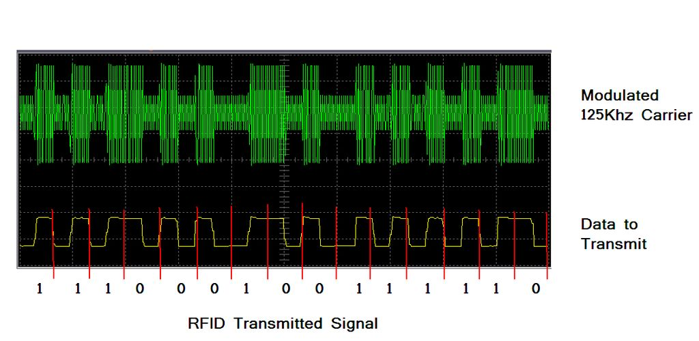
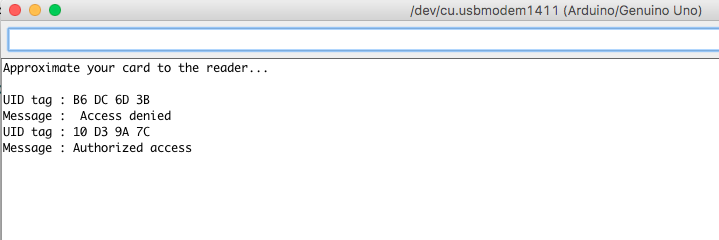
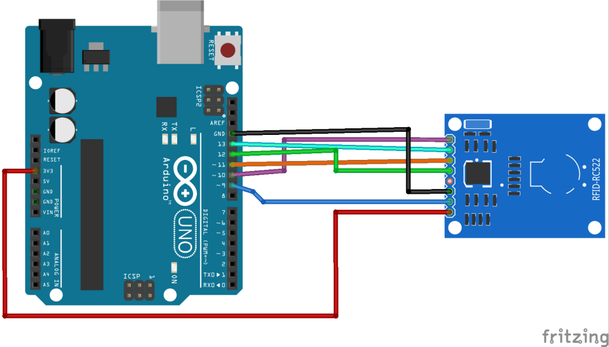

## Abstract

In this project, I attempt to break the security of RFID locks, using the locks of Building 39 as a case study since they rely on the same technique. I analyse how RFID locks and RFID cards work. RFID, or Radio Frequency IDentification, is a technique used to avoid physical contact between two modules. It is used in locks, where it works simply by bringing the card close to the lock without any physical contact. The same technique is used for payments: the new generation of cards no longer require physical contact to pay, which makes research into the security issues of this rich field a necessity. I set out to identify the mechanism these locks use and compare it with what we have been discussing in the computer communications class. In this report I share my findings and the method I used to break the security of the locks.

## Introduction

This project is about Radio Frequency IDentification based locks. I tried to break the security of RFID keys by identifying their Unique ID and cloning it onto another, empty key. The case study covers the room locks in Building 39, which use the same technique. I focus on how parity checks and checksums can be used to break the security of the keys. In addition, I explain how RFID works by showing the original signal, the modulated signal, and Manchester encoding. I use an Arduino UNO and an RC554 RFID reader to simulate the signals and the electric circuit. The goal is to apply what we learned in this course and show how important it is in the field of network security.

## Theory

### RFID Working Concept

RFID, or Radio Frequency IDentification, is the term used to describe a wide range of methods that allow information stored inside electronic "tags" to be read by a reader without using wires. Various standards, encoding schemes, and frequencies are in common use. In this project, I describe the 125 kHz standard, which is common for access control devices.

125 kHz RFID tags are usually encased in a business-card-sized piece of plastic or a round disk. The tag consists of a coil of wire connected to a microchip. When the tag is brought into proximity with a reader, energy is coupled inductively from the reader to the microchip inside the tag.

The energy from the reader has a dual use: first, it powers the card; second, it provides a communication medium for the data to be transmitted. Once powered up, the tag modulates the bit pattern programmed into it using a signal that the reader can detect. The reader then reads this bit pattern and passes it on to the door controller. If the bit pattern matches an authorized one, the door is opened. If the bit pattern does not match an authorized one, the door will not open.

The RFID system discussed in this example has the following format:

```
1111111110010111000000000000001111100010111110111101001111010000
```

### Manchester Encoding

One interesting feature of the data transfer between the card and the reader is that the data is encoded using Manchester encoding. This is a way of encoding data so that it can be transmitted over a single wire while ensuring that the clock information can be recovered easily. With Manchester encoding, there is always a transition in the middle of each bit. To transmit a 1, the transition goes from low to high; to transmit a 0, the transition goes from high to low. Because the transitions occur in the middle of each bit, you can be sure that you have locked onto valid data.



Figure 1: Data and Modulated Signal in 125Khz RFID Card

## Simulations

We defined an RFID card with the unique ID 10 D3 9A 7C and another card with a different unique ID. The white card has authorized access and the black one does not. We gave the reader the UID we wanted to grant access to, and we obtained the following results.



Figure 2: Simulations of Authorized Cards and Unauthorized Card

This simulation shows that the reader recognized the authorized card simply by identifying its unique ID. The same concept is used in locks and RFID-based credit cards.

## Algorithms

### Data Format

I started by building the RFID reader circuit in order to capture the data that is sent when the card is brought close to the reader. This step lets me discover the type of the data and its content. RFID cards usually have a number printed on them, and this number reflects the data stored in the card. In my case, the numbers were hidden, but I obtained them directly from the RFID reader.

The card held **0007820706  119,21922**, and it transmits this in the following binary form:

```
1111111110010111000000000000001111011110101001010101000010101100.
```

If we investigate the transmitted signal, we can see that the first set of bits, "111111111", is the start sequence used to tell the reader that a key is coming and should be interpreted. The reader also uses it as a semaphore to lock the critical section while reading data.

From the literature, I knew that the data is transmitted in groups of 4 bits, with a parity bit at the end of every group. So the data being sent can be divided into these groups as follows:

**00101 11000 00000 00000 01111 01111 01010 01010 10100 00101 01100**. If we ignore the parity bit for the moment, we get:

**0010 1100 0000 0000 0111 0111 0101 0101 1010 0010 0110**. If we convert this data from binary to hexadecimal, we get:

0010 : 2, 1100 : C, 0000 : 0, 0000 : 0, 0111 : 7, 0111 : 7, 0101 : 5, 0101 : 5, 1010 : A, 0010 : 2, ***0110*** **: Checksum**. So this code can be rewritten simply as **2C007755A2**. If we break it into 3 parts, we get: 2C 0077 55A2. We then convert this number to decimal to compare it with the value stored in the card.

Here 2C is simply a constant that identifies RFID cards, 0077 is 119, and 55A2 is 21922. So this represents the second part written on the card, ***119, 21922***. If we look at the number from a different angle, 7755A2 is ***0007820706***, which represents the first part stored on the card.

At this point, we understand how RFID cards work. Taken as a whole, the number represents the first number on the card in hexadecimal; divided into two parts, it gives the second number in hexadecimal.

### Error Detection Mechanisms

We ignored the checksum earlier in order to give a clearer overview of how RFID cards and locks work. The checksum is an error-control mechanism that ensures all transmitted bits are received successfully. In our case, we used both vertical and horizontal even parity checks, then added up the elements to obtain a checksum that is sent at the end of the transmitted data. We get:

```
00101 2
11000 C
00000 0
00000 0
01111 7
01111 7
01010 5
01010 5
10100 A
00101 2
0110 checksum + 0 stop bit
```

At the receiver, it adds the checksum to the received data and takes the complement in order to check whether the data was sent successfully.

## Implementation

### Electrical Components

- Arduino UNO
- RFID RC554
- Cables

### Circuit Design



Figure 3: Arduino Uno with RC554 Reader Circuit Sketch

### Code in Arduino-C

```
#include <SPI.h>
#include <MFRC522.h>
#define SS_PIN 10
#define RST_PIN 9
MFRC522 mfrc522(SS_PIN, RST_PIN);   

void setup() {
  Serial.begin(9600);   
  SPI.begin();     
  mfrc522.PCD_Init();   
  Serial.println("Waiting for cards...");
  Serial.println();

}
void loop() {
  if ( ! mfrc522.PICC_IsNewCardPresent()) {
    return;
  }

  if ( ! mfrc522.PICC_ReadCardSerial()) {
    return;
  }

  Serial.print("UID tag :");
  String content= "";
  byte letter;
  for (byte i = 0; i < mfrc522.uid.size; i++) {
     Serial.print(mfrc522.uid.uidByte[i] < 0x10 ? " 0" : " ");
     Serial.print(mfrc522.uid.uidByte[i], HEX);
     content.concat(String(mfrc522.uid.uidByte[i] < 0x10 ? " 0" : " "));
     content.concat(String(mfrc522.uid.uidByte[i], HEX));
  }
  Serial.println();
  Serial.print("Message : ");
  content.toUpperCase();
  if (content.substring(1) == "10 D3 9A 7C") { //change here the UID
    Serial.println("Authorized access");
    Serial.println();
    delay(3000);
  } else {
    Serial.println("Access denied");
    delay(3000);
  }
}
```

## Importance

This project matters because it investigates RFID bypassing techniques at a time when the trend is moving toward wireless locks. New payment methods have become wireless as well, relying on either RFID or NFC, both of which are rich fields in terms of security. Research is not yet conducted at an advanced enough level, since the locks, as we demonstrated, can be easily bypassed. This project is an attempt to raise awareness about these new technologies in order to protect people's privacy in the future.

## References

*“Defining strong privacy for RFID.” ACM Transactions on Information and System Security (TISSEC). ACM, n.d. Web. 05 May 2017.*

*Drj113. “A Universal RFID Key.” Instructables.com. Instructables, 16 June 2016. Web. 05 May  2017.*

*“Security Access using MFRC522 RFID Reader with Arduino.” Random Nerd Tutorials. N.p.,  n.d. Web. 05 May 2017.*
