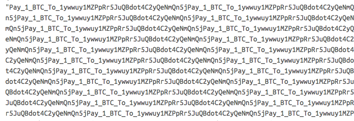

## Introduction

I have been investigating the impact of the Memcached DDoS attacks that are widely used against servers today, especially after one took down GitHub with a 1.7 Tbps DDoS attack, the largest DDoS attack ever recorded.

## How the Attack Works

Hackers use vulnerable Memcached servers to launch a DDoS attack and take down servers by sending forged UDP packets on port 11211. The vulnerability exists because the implementation of the Memcached servers' UDP protocol is flawed, and anyone with some basic knowledge of a scripting language can launch a major Distributed Denial of Service (DDoS) attack. In essence, the technique uses Memcached servers to send requests to a destination server.

## Finding Vulnerable Servers

A list of 17,000 vulnerable servers was published, and it is a jackpot for hackers, who can simply take the list and send forged UDP requests from the published IPs. There is also another technique: using the Shodan API to find Memcached servers by searching for "port: 11211". This requires an upgraded account in order to use such filters.

Researchers have called this an amplification attack. The published proofs of concept use one of the techniques mentioned above to find the vulnerable servers.

## The Surprise: A Bitcoin Ransom Note

In addition, the same techniques can be used to leak data from the vulnerable servers and store it locally. This is where I discovered the surprise. I tried to analyze the dump of some vulnerable servers, and here is what I found:

It is a Bitcoin ransom note in which the hackers ask the admins of the web servers to pay 1 BTC to the specified address in order to stop the attack. This is yet another method of making money from DDoS attacks.

## Conclusion

Currently, there are an estimated 88,000 misconfigured Memcached servers that can be abused for upcoming DDoS attacks.
