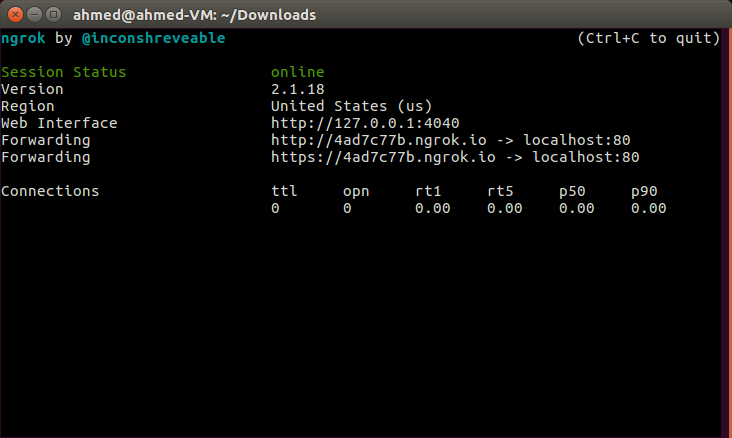

## The Problem

I was working on a personal project with some friends. It was hosted on a virtual machine running Ubuntu Xenial Xerus, and we reached the point where we needed to access it from other computers that were not on the same LAN in order to test it.

I first tried to access it from the host, which runs macOS Sierra. However, I ran into many problems with VirtualBox and bridged networking, because I am connected to a complex network infrastructure. It is not like the default configuration, so I only managed to make the VM visible to the host itself, which was useless in my case.

Next, I tried to access it through its external IP. That worked, but I needed to configure the router to allow NAT. This step was impossible for me, since I did not have the necessary credentials.

## The Solution

After reading about this issue, I found an elegant solution. There are two tools that let you expose a local server behind a NAT or firewall to the internet. In this post, I will focus on the more interesting and unlimited one.

The tool is called ngrok, and you can download it from <https://ngrok.com>. To configure it, follow these steps:

1. Unzip the downloaded file.

2. Run the following command in your terminal for the documentation: ***./ngrok help***

3. Run the following command in your terminal to make <http://localhost:80> accessible online: ***./ngrok http 80*** . You can change the port depending on where your application is listening. Check that the firewall is allowing traffic on that specific port.

4. You will see a link of the form ***\*.ngrok.io*** in your terminal. This is the link you can share with your friend to access your localhost. It will look like the following figure:

You can also inspect the requests and the devices connected to your localhost at <http://localhost:4040>.

P.S.: These steps were tested on Ubuntu Xenial Xerus running on VirtualBox.
