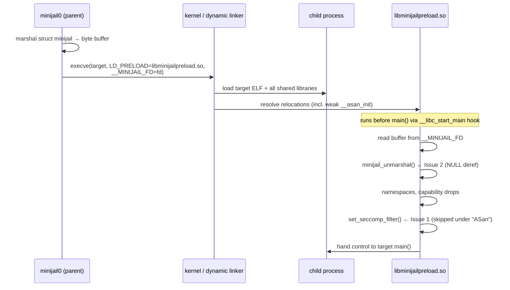
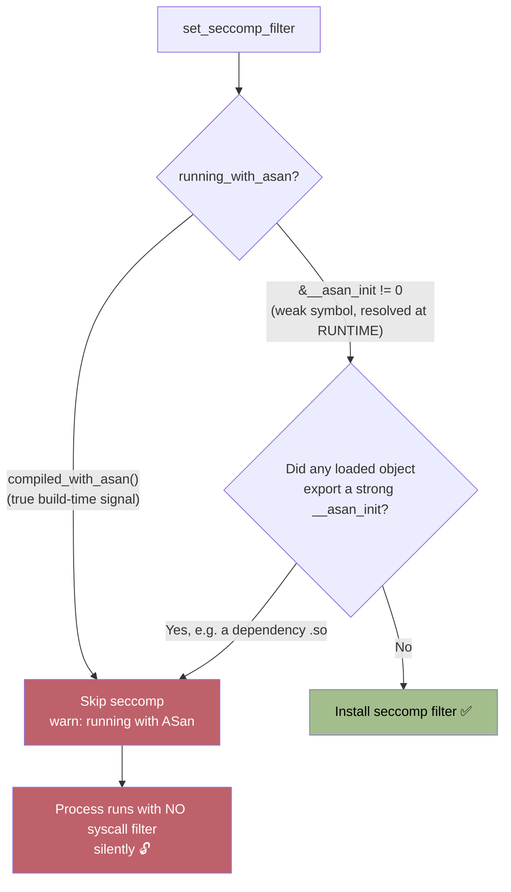
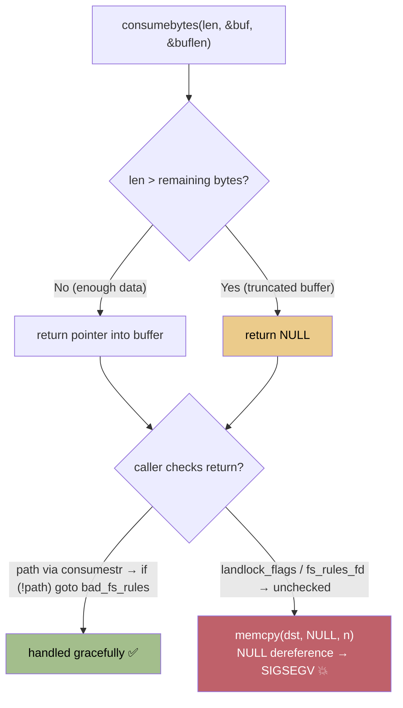
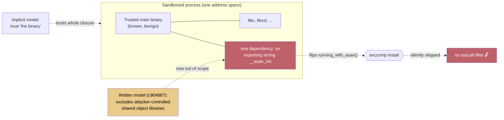

[Minijail](https://github.com/google/minijail) is the sandboxing tool that sits under a large amount of ChromeOS and Android. It launches a process, drops privileges, sets up namespaces, and installs a seccomp filter so that a compromised service can only make the syscalls it is supposed to. It is small, old, and widely deployed, exactly the kind of code you want to be boring.

This post walks through two findings I reported against minijail, the static analysis and commit archaeology behind each, and a third detail that ties them together: the gap between **what the code says about itself** and **what it actually does**. Along the way the project's threat model went from implicit to written down, and the timing is part of the story.

Both issues were ultimately closed as out of scope, and the scope call is defensible. The interesting part is the engineering, not the bounty.

The two findings:

- **Issue 1: Seccomp silently skipped via a weak ASan symbol** (sandbox escape). Lives in [`util.h` / `running_with_asan()`](https://chromium.googlesource.com/chromiumos/platform/minijail/+/refs/heads/main/util.h) and [`set_seccomp_filter()` in `libminijail.c`](https://chromium.googlesource.com/chromiumos/platform/minijail/+/refs/heads/main/libminijail.c).
- **Issue 2: NULL dereference in `minijail_unmarshal()`**. Lives in [`libminijail.c:1885`](https://chromium.googlesource.com/chromiumos/platform/minijail/+/refs/heads/main/libminijail.c#1885).

## How minijail jails a process

The detail that matters for both findings is *how* minijail sandboxes a target. The default path is `LD_PRELOAD`. The parent process:

1. Serializes the jail configuration (the `struct minijail`) into a flat byte buffer.
2. Spawns the child with `libminijailpreload.so` injected via `LD_PRELOAD`, passing the buffer over a file descriptor named in the `__MINIJAIL_FD` environment variable.
3. Inside the child, before `main()` runs, the preload library hooks `__libc_start_main`, reads the buffer back, deserializes it, and *then* applies the sandbox: namespaces, capability drops, and finally the seccomp filter.



So `libminijailpreload.so` runs inside **every** sandboxed child, executes the deserializer on data that crossed a process boundary, and is the thing responsible for actually turning seccomp on. Both findings live on this path.

---

## Issue 1: A weak symbol silently disables seccomp

### The mechanism

Minijail skips installing a seccomp filter when it believes it is running under AddressSanitizer, because ASan makes syscalls the policy would not permit and the process would otherwise crash. The decision is `running_with_asan()` in `util.h`:

```c
void __asan_init(void) attribute_weak;     /* __attribute__((weak)) */
void __hwasan_init(void) attribute_weak;

static inline bool running_with_asan(void)
{
    /*
     * There are some configurations under which ASan needs a dynamic (as
     * opposed to compile-time) test. Some Android processes that start
     * before /data is mounted run with non-instrumented libminijail.so, so
     * the symbol-sniffing code must be present to make the right decision.
     */
    return compiled_with_asan() || &__asan_init != 0 || &__hwasan_init != 0;
}
```

And the gate in `set_seccomp_filter()`:

```c
static void set_seccomp_filter(const struct minijail *j)
{
    /*
     * ... Skip setting seccomp filter in that case.
     * 'running_with_asan()' has no inputs and is completely defined at
     * build time, so this cannot be used by an attacker to skip setting
     * seccomp filter.
     */
    if (j->flags.seccomp_filter && running_with_asan()) {
        warn("running with (HW)ASan, not setting seccomp filter");
        return;     /* <-- seccomp silently skipped */
    }
    /* ... install the filter ... */
}
```

The flaw is in `&__asan_init != 0`. This is **not** resolved at build time. `__asan_init` is a *weak* symbol, and a reference to a weak symbol in a shared object becomes an `R_X86_64_GLOB_DAT` relocation that the dynamic linker resolves **at process startup**, against the symbol tables of every object loaded into the process, including the main executable and every shared library it pulls in.

The relocation is visible in the preload library that gets injected into the child:

```text
$ readelf -r libminijailpreload.so | grep asan
000000037fe0  R_X86_64_GLOB_DAT  __asan_init + 0
000000037ff8  R_X86_64_GLOB_DAT  __hwasan_init + 0

$ nm -D libminijailpreload.so | grep asan
                 w __asan_init      # 'w' = weak, unresolved at link time
                 w __hwasan_init
```

If **anything** loaded into the child process exports a *strong* `__asan_init`, the dynamic linker binds the preload library's weak reference to it. Then `&__asan_init` is non-zero, `running_with_asan()` returns true, and seccomp is never installed. The failure is silent: the parent logs `running with (HW)ASan, not setting seccomp filter` and continues as if the sandbox were in place. No policy violation, no crash, no signal.

Crucially, this does not require a malicious main binary. The binary can be fully trusted; a single shared object anywhere in its transitive dependency graph that exports that symbol is enough to disable seccomp for the whole process.



The comment claims only the left branch exists ("completely defined at build time"). The right branch, added later, is the one an attacker can reach.

### The discrepancy: the codebase contradicts itself

The two comments sit a couple of files apart and say opposite things:

- `libminijail.c` asserts `running_with_asan()` "**is completely defined at build time, so this cannot be used by an attacker** to skip setting seccomp filter."
- `util.h`, where the function actually lives, explains it needs "a **dynamic (as opposed to compile-time) test**" and that "the **symbol-sniffing code** must be present to make the right decision."

A little `git log -L` explains how the code ended up disagreeing with itself:

| Date | Commit | Effect |
| --- | --- | --- |
| 2016-04-06 | [`2413f37`](https://chromium.googlesource.com/chromiumos/platform/minijail/+/2413f3713ae8a306a23550e2eecd59f380f34eae): *Skip setting seccomp filter when running with ASan* | The "completely defined at build time" comment is written. At the time it is essentially true; the check is a compile-time macro. |
| 2019-04-22 | [`fc81455`](https://chromium.googlesource.com/chromiumos/platform/minijail/+/fc81455b5afe2aa384dcbc4239a7b58e2a4f4a0e): *libminijail: Bring back the runtime ASan/HWAsan checks* | The runtime weak-symbol probe (`&__asan_init != 0`) is **re-added** for Android processes that start before `/data` is mounted. |

The 2019 commit is what makes the 2016 comment false. The security assumption, "an attacker cannot influence this", was written for a version of the function that stopped existing in 2019, and the comment was never updated. It became a fossil: a security claim the code had quietly outgrown. The dangerous part is that it reads as a deliberate, reasoned dismissal of *exactly this attack*, which makes a reviewer far less likely to look again.

### The response

The report was triaged and closed as out of scope. The reasoning: minijail sandboxes *known, benign* binaries, and the project does not aim to contain attacker-controlled code. The one line worth quoting verbatim, because it captures the disposition exactly:

> while this bug is interesting from a technical perspective, it would fall out of scope

That scope call is reasonable for a *malicious binary*. The sharper version of the finding is that it needs no binary control at all: a compromised shared library in an otherwise-trusted process's dependency graph is sufficient. A threat model that trusts a binary implicitly extends that trust to the binary's entire transitive library closure, and "benign binary processing untrusted data" is precisely the case minijail exists to protect. Hold that thought for the threat-model section.

---

## Issue 2: A NULL dereference in the unmarshaler

### The mechanism

Deserialization in `minijail_unmarshal()` uses a helper, `consumebytes()`, that returns `NULL` when the buffer is too short:

```c
void *consumebytes(size_t length, char **buf, size_t *buflength)
{
    char *p = *buf;
    if (length > *buflength)
        return NULL;          /* not enough bytes left */
    *buf += length;
    *buflength -= length;
    return p;
}
```

The caller handles that return value correctly *for strings* and incorrectly *for raw bytes*, in the same loop:

```c
for (i = 0; i < fs_rules_count; ++i) {
    const char *path = consumestr(&serialized, &length);
    uint64_t landlock_flags;
    void *landlock_flags_bytes =
        consumebytes(sizeof(landlock_flags), &serialized, &length);

    if (!path)                              /* string IS checked */
        goto bad_fs_rules;
    memcpy(&landlock_flags, landlock_flags_bytes,   /* bytes NOT checked */
           sizeof(landlock_flags));
    /* ... */
}
/* Unmarshal fs_rules_fd. */
void *fs_rules_fd_bytes =
    consumebytes(sizeof(j->fs_rules_fd), &serialized, &length);
memcpy(&j->fs_rules_fd, fs_rules_fd_bytes,          /* also NOT checked */
       sizeof(j->fs_rules_fd));
```

A buffer truncated after the path string makes `consumebytes()` return `NULL`, which flows straight into `memcpy` as the source pointer, an immediate NULL dereference and `SIGSEGV` at `libminijail.c:1885`. Because `minijail_unmarshal()` runs inside `libminijailpreload.so` on the buffer handed to the child over `__MINIJAIL_FD`, the malformed input crosses a process boundary to get there.



The same loop validates the string and forgets the two raw-byte consumes; the pattern is applied halfway.

### The discrepancy: the code refutes its own dismissal

The finding was initially dismissed with the observation that calling a function unsafely is not itself a security bug. But the code three lines up tells a different story: the author *does* validate untrusted input here, with `if (!path) goto bad_fs_rules;`, yet they simply missed the two `consumebytes()` results in the same loop. The intended contract is plainly "validate everything you consume from the buffer." Two consumes were skipped. That is not unsafe *calling*; it is an incomplete implementation of the function's own validation pattern.

Commit archaeology points straight at the Landlock feature work that bolted `fs_rules` onto the marshaling format:

| Date | Commit | Introduced |
| --- | --- | --- |
| 2022-10-30 | [`98b39a6`](https://chromium.googlesource.com/chromiumos/platform/minijail/+/98b39a6b5160934bb5199232e21ddd6914b43599): *minijail: marshal/unmarshal fs_rules list* | the unchecked `landlock_flags` memcpy |
| 2023-02-16 | [`64b0376`](https://chromium.googlesource.com/chromiumos/platform/minijail/+/64b037655371b2deb63ca4c5e43b8ced1d0575e5): *minijail: allow Landlock to work with minijail_close_open_fds()* | the unchecked `fs_rules_fd` memcpy |

Both unchecked sites entered as part of adding a feature, not as part of the original parser. It is a classic shape: the format grows, new fields are appended to the consume sequence, and the validation that guarded the *old* fields is not extended to the *new* ones. A robust IPC consumer returns an error on malformed input; it does not dereference NULL. Whether that rises to a *security* bug depends entirely on the threat model, which is the through-line of this post.

---

## The threat model that arrived after the reports

Both findings turn on the same question: **does minijail's threat model include attacker-influenced shared libraries, or malformed data, reaching an otherwise-trusted process?** When I reported, `README.md` had no threat-model section at all. The model was implicit.

On **2026-04-06**, a "Purpose and threat model" section was committed ([`c904887`](https://chromium.googlesource.com/chromiumos/platform/minijail/+/c904887947abd1ee66a08d82eb17365632130548)):

```text
## Purpose and threat model

Minijail is intended for sandboxing known binaries on a system. It is intended
to mitigate the risk if a service is compromised through a bug, or a
confused-deputy scenario.

It is not designed for safely running malicious code, including
attacker-controlled binaries or binaries that may use attacker-controlled
shared object libraries.
```

Note the final clause: "**or binaries that may use attacker-controlled shared object libraries.**" That is, almost word for word, the shared-library scenario at the center of Issue 1.

The clause matters because it redraws where the trust boundary sits. The implicit model trusted "the binary"; the gap was everything the binary loads:



Trusting a binary implicitly extends trust to every shared object it loads, and they all share the one address space and symbol namespace.

The full timeline, with commits and report dates:

| Date (UTC) | Event |
| --- | --- |
| 2016-04-06 | `2413f37`: ASan seccomp skip + "completely defined at build time" comment. |
| 2019-04-22 | `fc81455`: runtime weak-symbol probe re-added; the comment is now false. |
| 2022-10-30 | `98b39a6`: unchecked `landlock_flags` memcpy lands. |
| 2023-02-16 | `64b0376`: unchecked `fs_rules_fd` memcpy lands. |
| 2026-02-03 | Issue 2 (NULL deref) reported. |
| 2026-02-24 | Issue 1 (seccomp bypass) reported. |
| 2026-03-03 | Both reports closed as out of scope / intended behavior. |
| **2026-04-06** | `c904887`: "Purpose and threat model" section added to `README.md`, **explicitly excluding "attacker-controlled shared object libraries."** |

I do not read this as bad faith. Writing down a previously-implicit threat model after a report probes its edges is the *right* engineering response, and the boundary being documented is a net good. But it does reframe what "intended behavior" meant: at the moment the reports were closed, the behavior was not yet excluded by any written threat model. The exclusion was authored afterward. The threat model did not catch the bugs; the bugs shaped the threat model.

---

## Takeaways for ASan / `LD_PRELOAD` sandboxes

These two are specific, but the failure shapes generalize to anything that mixes sanitizer detection, weak symbols, and preloaded code.

**A weak symbol is an input, not a constant.** Any `&weak_symbol != 0` test in a shared object is resolved by the dynamic linker against the *whole* process image at startup. If untrusted code, including a dependency `.so`, can place a strong definition of that symbol, the test is attacker-influenced. Treat weak-symbol probes as runtime input. If a security decision must be build-time, gate it on a compile-time macro (`__SANITIZE_ADDRESS__` / `__has_feature`) and nothing else.

**"Are we under ASan?" should fail closed, not open.** Disabling a security control on a *guess* about the build configuration inverts the safe default. A misdetected ASan build that still installs seccomp merely crashes loudly in a test environment; a misdetected production build that *skips* seccomp ships a silent hole. When in doubt, keep the control on.

**`LD_PRELOAD` initialization is attacker-adjacent.** Code that runs before `main()` in a preloaded library shares its address space, symbol namespace, and loaded objects with everything else in the process. Anything it reads (relocations, environment variables, IPC buffers from a parent) is part of its attack surface, even when the "main" program is trusted.

**Validate every field that crosses a process boundary, every time.** The unmarshaler already knew this: it checked the strings. The misses were the two raw-byte consumes added later. "Mostly validated" is a deserializer bug waiting for a truncated buffer. Check the return value of *every* parsing helper, and when a serialized format grows a field, extend the validation to the new field in the same change.

**Trusting a binary means trusting its entire dependency closure.** "We only sandbox known, benign binaries" sounds tight until you remember a known binary loads dozens of shared objects, each with its own supply chain. A defense-in-depth tool should be especially hostile to "one component in the process can silently turn me off."

## Lessons learned

- **A code comment is a security control, and it rots like one.** The `running_with_asan()` comment was true in 2016 and false from 2019 on, but it kept doing its job, convincing readers the path was safe. A stale "this is safe because..." comment is worse than no comment: it discourages scrutiny of the very thing that needs it. When you change the mechanism behind a security check, the comment asserting it is safe is part of the change.

- **Validation patterns are easy to apply halfway.** When the same loop checks one consume and not the next, the bug is rarely ignorance; it is a pattern that was not carried all the way through when the format grew. Code review and lints that flag "consume result used without a NULL check" catch this class cheaply.

- **Write the threat model down first.** An implicit threat model gets argued one report at a time and amended after the fact. A written one, even three lines, lets everyone, researchers included, calibrate *before* spending weeks on something that will be ruled out of scope. minijail's README is better for finally having one. The lesson for any project: document the boundary before someone tests it for you.

- **"Out of scope" and "not a real issue" are different statements.** Both findings are out of scope under the current model. Neither is thereby *non-existent*: a stale assumption that disables seccomp, and an unchecked deserializer that crashes on truncated IPC, are real properties of the code regardless of who is in a position to trigger them. The most durable artifact of the whole exchange is not a CVE; it is a ten-line README diff showing a threat model being drawn precisely around the bugs that tested it.
