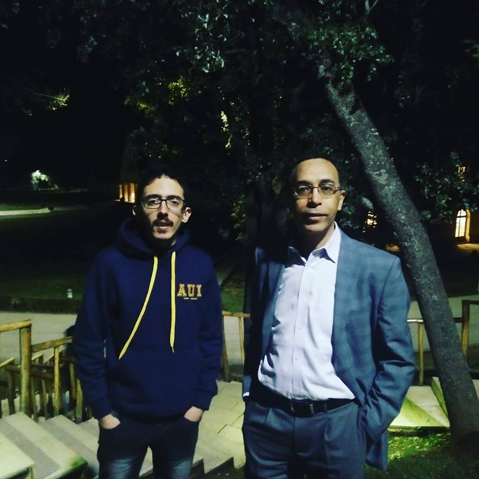

## The Debate and Its Schools of Thought

The debate over Islam and science spans multiple disciplines and many thinkers from different schools of thought. It has been viewed from various angles: the perennialist philosophy of Sayyed Hossein Nasr, the secular modernism of Pervez Hoodbhoy, the Islamic ethical science of Muhammad Abdus Salam, and the universalist science and Islamization of knowledge of Ismail R. Al-Faruqi and Sayyed Naquib Al-Attas. Yet the debate was deflected from its core by attempts to reshape science itself. The "new" shape of science proposed by the intellectuals above differed according to each leader's school of thought, ranging from critical Quranic interpretations and postmodernism to the Islamization of knowledge and sacred science.

In the early nineties, the debate subsided after several events that directly affected these schools of thought. For example, Al-Faruqi was killed, and the Ijmalis disbanded and pursued other projects. International events also bore directly on the debate, such as the end of the Cold War and the first Gulf War.

New voices then emerged to represent the traditionalist school and criticize modernity, such as Mehdi Golshani and Muzaffar Iqbal, who adopted Nasr's ideas. On the other hand, other intellectuals set out to harmonize Islam and science from a solid scientific background; described as a new generation of thinkers, they include Nidhal Guessoum and Basil Altaie. They take science as it is and try to harmonize it with Islam without reshaping it, unlike the schools of thought described above.

According to Stefano Bigliardi, this new generation of harmonizers of Islam and science has three traits in common:

1. They are practicing scientists, so they can analyze a subject from a solid scientific background, drawing on interdisciplinary competence and intercultural education.
2. They constantly refer to philosophical traditions, including non-Islamic ones.
3. They have the ability to address a subject from multiple cultural and religious points of view.

According to Guessoum, the monograph *Islam and the Quest for Modern Science* (Bigliardi, 2014) is of particular interest because it opens with six interviews with six Muslim intellectuals. Bigliardi excluded Al-Naggar and Oktar from the "new generation" because of their views on modern science: they do not fit the three traits he used to describe it. He concluded that the new school of harmonizing Islam and science is the most relevant one today. Some other thinkers, such as Pervez Hoodbhoy and Taner Edis, had no problem with the idea of harmonizing Islam and science; their disagreement with the harmonizers was philosophical, which led Bigliardi to describe them as anti-harmonizers. Both harmonizers and anti-harmonizers, however, regard the bridging approaches that harmonize Islam and science by reshaping it as an illusion of harmony.

Anti-harmonizers advocate reshaping modern science and the scientific miracles in the Quran, while the harmonizers are scientists who master the details of science, which prevents them from following the masses and interpreting the Quran in a literal way.

To understand the debate over Islam and science, we should include the Ijaz approach of the traditionalists, since it is the idea currently adopted by the Muslim community and defended by many Muslim "thinkers" such as Al-Naggar, Yahya, and Naik in the Arab world, Turkey, and the Indo-Pakistani subcontinent respectively, in addition to the Islamization of knowledge initially adopted by Al-Faruqi. The Ijaz approach concerns the scientific miracles in the Quran and, to some extent, in the Sunna. It is therefore one of the critical challenges facing the "new generation," because it is an internal problem within the house of Islam. The Islamization of knowledge approach was supported by many Islamic intellectuals for years after it was launched in 1970. However, it disappeared in many countries except Malaysia, the home country of Al-Attas, who is considered the representative of this approach after Al-Faruqi, and Washington, DC, the region where Al-Faruqi lived and founded the International Institute of Islamic Thought, which aims to protect his ideas on Islamizing science.

## "Islam and Science": The Next Phase of Issues

After presenting the "new generation," the author lists several topics that need to be worked on in order to clarify them for other scholars and the general public. Bigliardi suggested one or more topics to each intellectual of the "new generation" depending on his or her field. The author identified two main points where the debate stands: evolution and miracles.

### Evolution

According to a survey conducted in 2008, 65 to 75 percent of Muslims completely reject or fundamentally disagree with evolution, the idea that one species can evolve into another. This rejection can be explained by three main points: the authority of scripture over knowledge in Islamic culture, the place of scientific evidence in the Muslim community, and the education the generation is receiving. The only thinker of the "new generation" who has tackled the theory of evolution initiated by Darwin is Nidhal Guessoum. Altaie tends to accept the theory of evolution but rejects both the idea of random mutations and intelligent design; he believes that random mutations cannot produce the amazing creatures we see in nature. Golshani, on the other hand, believes that the Quran does not reject evolution, noting that the infusion of atheism into the theory of evolution is a source of confusion.

### Miracles

Miracles are another major challenge facing the "new generation." To better understand the different approaches Muslim intellectuals have adopted, we should ask some fundamental questions in order to define miracles: do they break the laws of nature, do they prove the existence of God and supernatural creatures, and do they occur with prophets or ordinary people as well? In addition, miracles tend to be non-physical for the Prophet Muhammad, so did he have physical miracles?

To frame the topic of miracles, we can define them as phenomena that seem to break or contradict the laws of nature. At this point, we should distinguish this definition of miracles from phenomena that have not yet been proven by science. Some Christian theologians have suggested interesting approaches, such as treating miracles as extreme phenomena that represent a special occurrence within the natural processes, or treating them as phenomena that can be explained by divine action alone.

In Islam, positions on miracles differ from one school of thought to another:

- First, miracles can be explained as spiritual events that occurred to Muhammad. However, there are some exceptions to this definition, including the Quran, the night journey, and the splitting of the moon.
- Second, miracles happen only to prophets because they are supported and inspired by God.
- Third, according to Sufi-inclined people, miracles happen only to prophets, but the "awliya," or saints, are gifted as well.
- Finally, miracles are rejected by some intellectuals such as Sir Sayyed Ahmed Khan, who believed that God set up the laws of nature by convention with human beings, so they cannot be considered breakers of the laws of nature.

## Educational and Social Issues

Another issue Bigliardi raised in the six interviews is the Golden Age and the state of science in Muslim education. Many Muslims tend to hold a nostalgic view of the Golden Age in order to prove that what the West is achieving today is based on achievements made by Muslim scientists. However, this historical approach to the Golden Age should be corrected on two levels: the misinformation about the achievements themselves, and the way science was viewed.

## References

Guessoum, N. (2015). Islam And Science: The Next Phase Of Debates. Zygon®, 50(4), 854-876. doi:10.1111/zygo.12213

---

I wrote this article in December 2017. I had the chance to meet Nidhal Guessoum in March 2018, and I am now publishing the article I wrote about his journal article "Islam And Science: The Next Phase Of Debates," along with my picture with him at Al Akhawayn University.

It was a pleasure to meet him; he is very friendly, and I look forward to meeting him again somewhere else.

