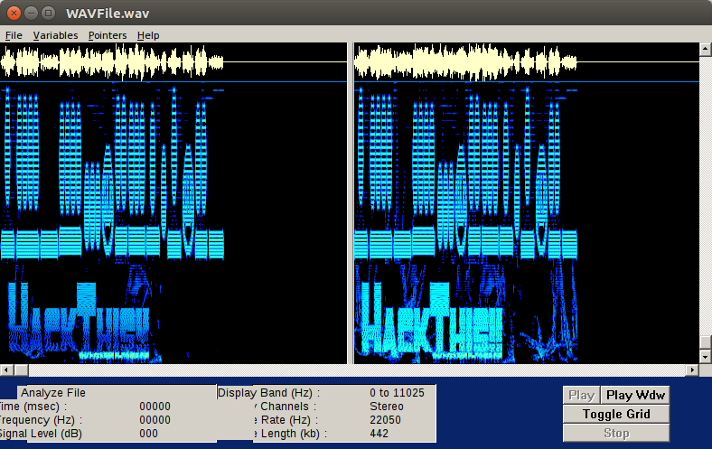
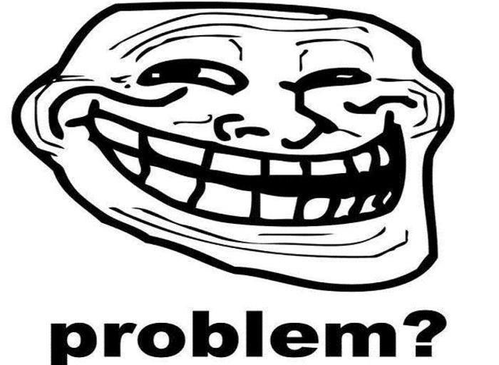
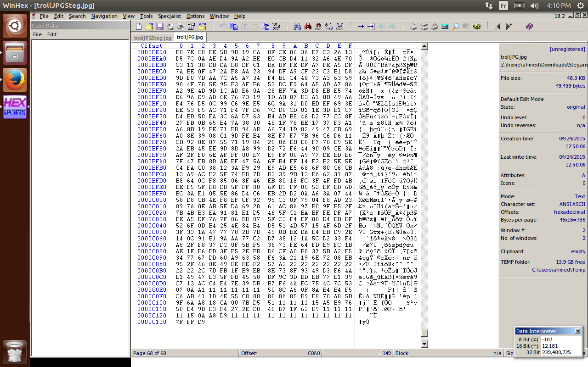
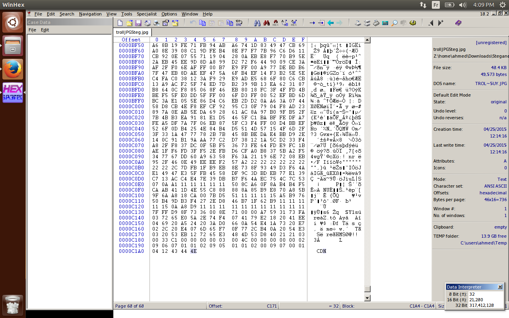

## Introduction

Steganography is one of the more complex fields in computer security. Its complexity comes from the limited resources that explain it, since it is rare to find a course dedicated to the subject. Yet steganography has always been with us. We simply do not pay attention to it.

Steganography is the art and science of embedding a secret message inside a cover message in such a way that no one, apart from the sender and the intended recipient, suspects the existence of the message. The word is a combination of two Greek words: *steganos*, meaning covered, and *graphia*, meaning writing.

Historically, it has always accompanied human beings. For instance, messages between empires were sometimes hidden in messengers' heads. People also used invisible ink to conceal their writing. So steganography is not, by definition, tied to computer science. It has historic roots, and it has played an important role in human communication and security.

## Steganography vs. Cryptography

If you read the definition above, you might be confused about the difference between steganography and cryptography. They share almost the same goal: protecting a message or information from third parties. However, they use different mechanisms to do so.

- **Cryptography** changes the information into an unreadable piece of data that cannot be understood without a decryption key. It therefore involves another concept: keys for encryption and decryption.
- **Steganography** does not change the format of the information. It simply hides the information from third parties. It can be used anywhere and anytime, as long as you tell the other party in the communication how to read or extract the information.

Technically, steganography conceals the existence of the message. It does not alter the structure of the secret message; instead, it hides it inside a cover file so that the secret message stays unseen. Cryptography, on the other hand, hides the contents of a secret message from malicious people. The structure of the message is scrambled to make it meaningless and unintelligible unless the decryption key is provided. In other words, cryptography encrypts the message, but the message can still be seen.

## What This Article Covers

In this article, I will describe two applications of steganography in two different file types.

1. **Audio steganography**, where we take an audio file that hides a secret message and try to analyze it. It can appear to be a meaningless track, but it carries an invisible meaning. This has many applications, mainly in military and government digital security.
2. **Image steganography**, where we hide a text file inside a picture and then reverse the operation to extract the message.

The process of analyzing a modified audio file, image, or any other file type is called steganographic analysis, or steganalysis. Technically, it can be linked to another concept: reverse engineering, the process of extracting a hidden piece of data from a different file type. I make the comparison between steganalysis and reverse engineering because they share a common point: seeing things from the back end. In other words, it can be defined as breaking the encapsulation layer that is hidden from the end user.

## Audio Steganography

Let's take a look at an audio file, which is basically a .wav file. You can download it from here: <https://www.dropbox.com/s/n4o3hdp9mfkadqf/WAVFile.wav?dl=0>.

It was a challenge in a CTF. You can find another audio file in one of the root-me.org steganography challenges that can be solved with the same technique. If you listen to it, you will just hear some noise that is meaningless to us. However, if you use Audacity or another audio analyzer, you will notice that this is not the case. In my own experience, I used an old program called gram. You can download it from here if you want to try the experiment: <https://www.dropbox.com/sh/x29xyo2vyjv1e8e/AACSTHW_x2pxHpZ4C9caZWska?dl=0>. The environment in which I ran the experiment was Ubuntu Xenial Xerus with wine1.6 installed to run Windows programs in a Linux-based environment. When you analyze the audio file, you will see the secret message, which is "***HackThis!!***" in our case.

As you can see, a hidden message lives inside a meaningless audio file.

## Image Steganography

For the image part, the steganography challenge was to detect the program used to hide a text inside an image. It was quite a funny image.

The problem was to analyze two identical images. At this level, we will not talk about file signatures and file extensions. I believe I will cover them in another article, because they are involved in other fields. At this stage, I used WinHex to analyze the hexadecimal part of the image. You can also use a text editor, such as gedit or Notepad, just to see the image from another perspective. I found a weird signature at the end of the modified image. This is the original image:

And this is the modified one. You can notice "***CDN***" at the end of the image:

I looked at this "weird" signature and found that it is the signature of a program called Hiderman, which can hide a text file inside an image. I used the same program to extract the message.

## Conclusion

This was just an overview of steganography. I will try to cover it in more depth in upcoming articles. I believe it is an important field to know about, since it is rarely taught in universities. It can change the way you see files: rather than treating them as "cute" pieces of data, you realize they can carry secret messages or information.

Image Copyright: WonderHowTo [http://img.wonderhowto.com/img/05/12/63537824039022/0/introduction-steganography-its-uses.1280×600.jpg](../images/steganography-the-art-of-hiding-secrets/0928e3f6-introduction-steganography-its-uses.1280x600.jpg)
